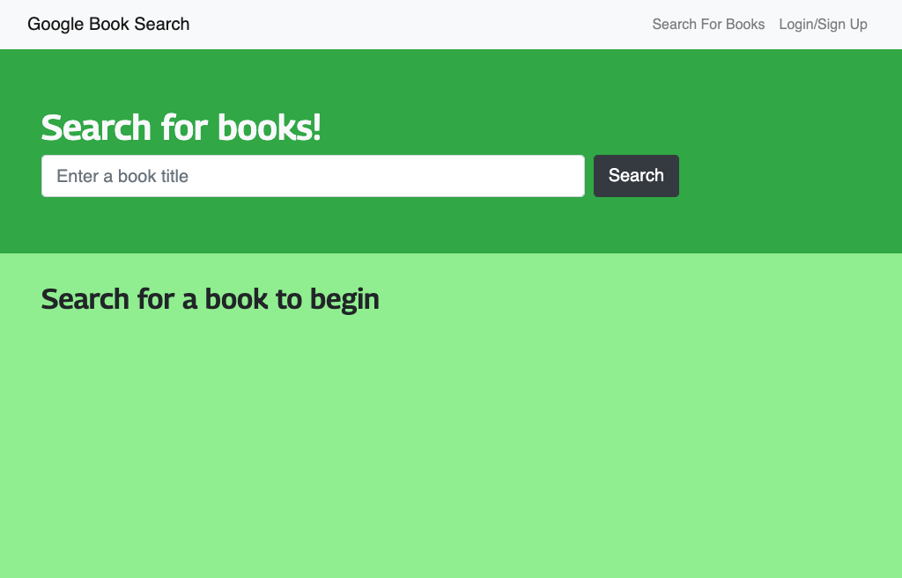

# Book Search Engine
  

  ## Description
  This Book Search application provides the user with the ability to search for books using the Google Book Search API. Optionally, a user may setup an account and save book listings to their account. The application allow users to save book searches. The app was built using the MERN stack with a React front end, MongoDB database, and Node.js/Express.js server and API. 

  ## Table of Contents
  * [Installation](#installation)
  * [Usage](#usage)
  * [License](#license)
  * [Contributing](#contributing)
  * [Tests](#tests)
  * [Questions](#questions)
  
  ## Installation
  In order to download necessary tools, first clone the repository. Navigate inside the project folder. If you do not have Node.js or npm installed, you will first need to install them. Run npm run developto deploy the project on your localhost.
  [Install Node.js and npm](https://docs.npmjs.com/downloading-and-installing-node-js-and-npm)

  ## Usage
  [Link to Heroku Deployment](https://book-search-ll.herokuapp.com/)
  Use the input field to search for books and click submit button. If you would like to save your results, you can click on the Login/Signup menu option and setup an account.

  
  

  ## License
  Licensed under [MIT License](https://spdx.org/licenses/MIT.html).

  ## Contributing
  Anyone can participate in the project to submit bugs and make pull requests for anything from typos to new content.
  If you are interested in fixing issues and contributing to this project, please refer to the [Contributor Covenant](https://www.contributor-covenant.org/).

  ## Tests
  Currently no tests exists for the application. 
  If you would like to contribute and help us by writing them, see the [Contributing](#contributing) section.

  ## Questions
  For more information about me and my other projects, visit my [GitHub profile](https://github.com/LindseyJeeJan).
  Reach me to report issues or with questions at [ljjlauria@mac.com](mailto:ljjlauria@mac.com).
